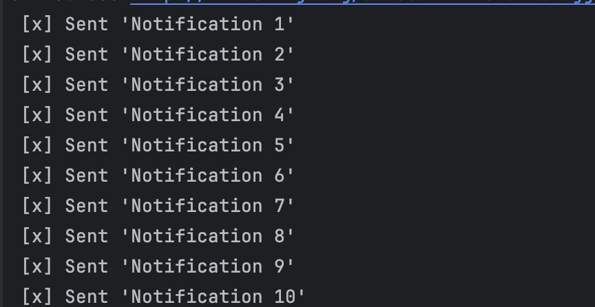
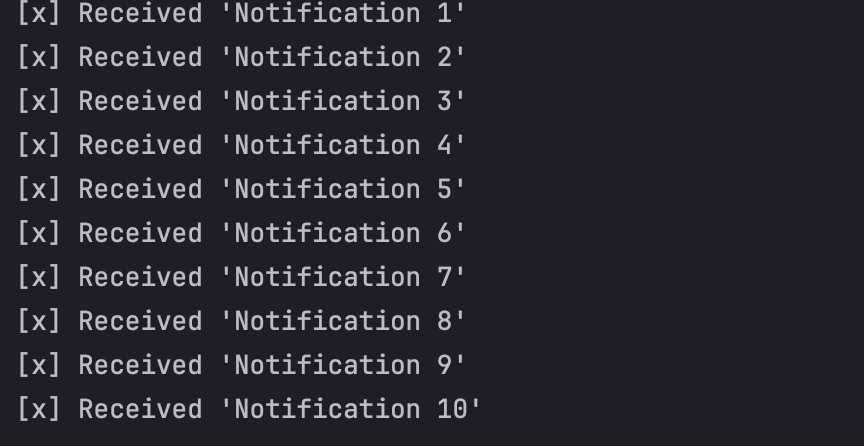

# Sistema de Notificaciones con RabbitMQ

Este proyecto implementa un sistema de **notificaciones** utilizando **RabbitMQ** para mensajería asincrónica. Se configuro **Productor** que envía notificaciones a una cola, y un **Consumidor** que recibe y procesa esas notificaciones.

### **Productor**:
- El **Productor** envía **notificaciones** a la cola `notifications` en **RabbitMQ**.
- Se generan 10 mensajes de notificación de forma secuencial, y cada uno es enviado a la cola `notifications`.

  

### **Consumidor**:
- El **Consumidor** está suscrito a la cola `notifications` y espera recibir los mensajes.
- Al recibir cada mensaje, el **Consumidor** lo imprime en la consola.

